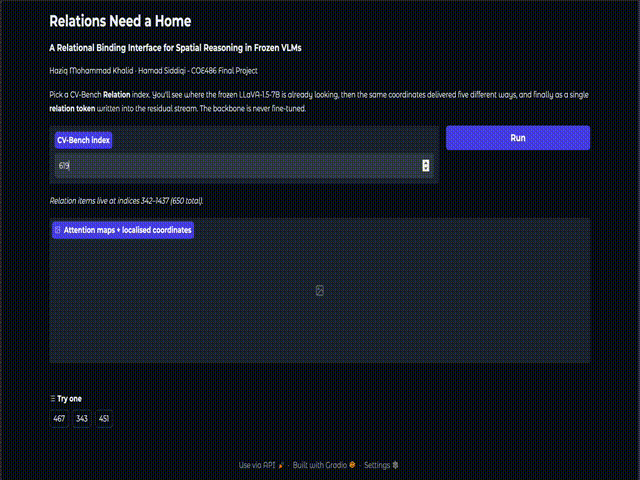

<div align="center">
  <h1>Relations Need a Home</h1>

### A relational binding interface for spatial reasoning in frozen vision–language models

<p align="center">
  
</p>

Haziq Mohammad Khalid · Hamad Siddiqi - Computer Vision (COE486)

</div>

---

## Contents

```
cv-project-final.ipynb    the experiments — run top to bottom
demo.ipynb                interactive demo (Gradio, one cell)
DEMO.gif
paper.pdf                 
README.md                 
```

---

## Demo

**Requires a GPU.** LLaVA-1.5-7B is ~14 GB in fp16. The demo doesn't run without GPU available

Run the single cell in demo notebook, it installs what's missing, downloads the weights, and prints a public Gradio link.

Type a CV-Bench Relation index and you get:

1. **The attention maps** for both objects, with the coordinate read from each
2. **What those two coordinates alone imply** — shown *before* any answer, so you see the answer
   sitting in the model's own attention
3. **The vanilla answer** from the frozen model
4. **All five deliveries** of those same coordinates (`nl_absolute`, `coords_xy`, `steer_abs`,
   `steer_rel`, `brief_2d`)
5. **Our relation token**, and then the same token with the coordinates **swapped**

The demo pulls the trained interface from
[`Haziq-exe/relational-binding-interface`](https://huggingface.co/Haziq-exe/relational-binding-interface)
(`abstractor_relation_kl_ce.pt`). It reads `relation_split.json` from the same repo and will warn
you above the results if the index you picked was in the training split.

Everything else is loaded from the Hub: no local files needed.


## Running the notebook

> **The notebook was written for and run on Kaggle notebooks (2× T4, ~16 GB each), with the model
> sharded via `device_map="auto"`. It has not been tested anywhere else.** Paths, the accelerator
> setup, and `RES_DIR` all assume that environment. It will most likely need adjusting to run on
> Colab or a local machine — expect to touch at least `RES_DIR` and the device handling. If you
> just want to see the method work, **use `demo.py` instead**: it is environment-agnostic and needs
> nothing but a GPU.

1. Open the notebook and Run All. It is designed for one top-to-bottom pass.
2. Outputs go to `RES_DIR`, which defaults to `/kaggle/working/results_v1` if present and
   `./results_v1` otherwise. Override with the `RES_DIR` env var.

**Resume-safety:** every prediction is appended to `RES_DIR/predictions.jsonl`, keyed by
(task, item, condition, swap). Re-running any cell skips what is already on disk, so it starts from where it left off.

### Notebook structure

Part F contains the experiments from the paper.

| Part | Contents |
|---|---|
| A | Setup, config |
| B | Pure-logic core: scorer, statistics |
| C | LLaVA-1.5-7B load, plus the 576-token geometry assertion |
| D | CV-Bench (the only dataset): Relation, Depth, Distance views |
| E | Method: attention → coords, text deliveries, latent steering, abstractor |
| F | Results: all tables and figures, written to `RES_DIR` |

### Outputs

```
results_v1/
├── predictions.jsonl              every generation, resume-safe
├── loc_cache.json                 cached coordinates, reused by every condition
├── relation_split.json            the fixed 70/10/20 split
├── table1_oracle.json
├── table2_relation.json / .tex
├── table3_crosstask.json
├── table4_routed.json
├── table5_abstractor_test.json
├── grad_probe.json                §6 verdict
├── abs_train_log_{ce_noscaler,kl_ce}.json
├── abstractor_relation_kl_ce.pt   ← the demo loads this from the Hub
└── figs/
    ├── fig1_main_relation.png     bars + CIs, with the oracle ceiling
    ├── fig2_crosstask_delta.png   the degradation heatmap
    ├── fig3_training_curves.png   CE vs distillation
    └── fig4_qualitative.png       vanilla-wrong → brief-fixed, with attention maps
```


## Method

```
attention → coordinates → delivery → generate → score
```

Every condition reads the same coordinates via one shared config (`RES_LOC`), and every steering
condition uses one shared config (`RES_STEER`), so conditions differ **only** in the delivery
mechanism.

**Why the coordinates are trustworthy.** Visual token *i* is exactly patch *i* of the CLIP 24×24
grid (row-major, CLS dropped), so a 24×24 attention map indexes the 576 visual tokens with no
learned alignment. Part C asserts this against the live processor and refuses to continue if it
fails.

Two details matter for localisation quality:

- **Relative attention.** Subtract the baseline looking pattern (mean attention-to-image over
  generic text positions) to remove position bias and attention sinks. Without it the maps mostly
  show where LLaVA always looks.
- **Denoise before smooth.** Zero the bottom quantile of attention mass first, so the filter cleans
  rather than smears the noise floor.

**The interface** is one relational-cross-attention block. Queries and keys are projected from the
two coordinates; their inner products form the relation; the *values* are content-independent
learned symbols — the relational bottleneck — which forces the output to encode how the objects
relate rather than what they are. It collapses to one 4096-d token, written at a reserved slot
(a duplicated final prompt token, so nothing is displaced) at layer 14, scaled down if it would
exceed the host token's own norm. See Appendix A of the paper for the full derivation.


## Results

CV-Bench, LLaVA-1.5-7B, greedy decoding, paired over identical item sets. 95% CIs are percentile
bootstrap (5,000 resamples). Both a paired-bootstrap p and an exact McNemar p are recorded for
every condition; the p below is McNemar.

### Perception is not the bottleneck (Relation, n=650)

| | |
|---|---|
| Vanilla accuracy | 0.648 [0.611, 0.685] |
| Coordinate oracle (same attention coords, oracle comparison) | **0.845** |
| Gap the model leaves on the table | **+0.197** |
| Oracle under swapped coords (sanity: should be ≈ 1 − oracle) | 0.155 |

### Same coordinates, different delivery (Relation, n=650)

| Condition | Acc | Δ vs vanilla | p | Swap acc | Real − swap |
|---|---|---|---|---|---|
| `vanilla` | 0.648 | | | | |
| `coords_xy` (raw x, y in the prompt) | 0.563 | −0.085 [−0.129, −0.042] | 0.0001 | 0.546 | +0.017 |
| `steer_abs` (absolute latent steering) | 0.669 | +0.022 [−0.014, +0.057] | 0.265 | | |
| `steer_rel` (relative latent steering) | 0.685 | +0.037 [+0.006, +0.068] | 0.026 | 0.568 | +0.117 |
| `nl_absolute` (each object's region in words) | 0.686 | +0.039 [+0.006, +0.072] | 0.026 | | |
| `brief_2d` (the relation as a sentence) | **0.768** | **+0.120** [+0.083, +0.159] | <0.0001 | 0.219 | **+0.549** |

The swap control is the one that matters. Feed `brief_2d` the wrong relation and accuracy collapses
to 0.219 — the model is *reading the relation*, not being nudged by the presence of extra text.
`steer_rel` gains a little but survives having the relation reversed (real − swap of only +0.117),
which is what a generic nudge looks like.

### The learned relation token (held-out test, n=131)

A module of ~18M params, against 7B frozen, reads the two coordinates and writes one token into
the residual stream at layer 14. Trained by context distillation from the `brief_2d` teacher with
counterfactual coordinate twins, and scored only on the held-out split.

| Condition | Acc | Δ vs vanilla | p | Swap acc | Real − swap |
|---|---|---|---|---|---|
| `vanilla` | 0.672 | | | | |
| `brief_2d` (the teacher) | 0.725 | +0.053 [−0.031, +0.137] | 0.281 | 0.252 | +0.473 |
| `abstractor` | **0.771** | **+0.099** [+0.008, +0.191] | 0.047 | 0.298 | +0.473 |

The student beats its teacher on this split, with a CI excluding zero and real − swap of +0.47.
Distillation reaches 0.846 val accuracy against 0.692 for plain CE.

### Un-gated injection damages 3D tasks

Δ accuracy vs vanilla. Depth and Distance are not extra benchmarks — they test whether a 2D
intervention breaks tasks it cannot help.

| Condition | Relation | Depth | Distance |
|---|---|---|---|
| `nl_absolute` | +0.039 | −0.073 | −0.040 |
| `coords_xy` | −0.085 | −0.240 | −0.017 |
| `brief_2d` | +0.120 | −0.220 | −0.020 |

`brief_2d` states only what 2D attention supports, and it still costs 0.220 on Depth
(0.783 → 0.563). A 2D spatial brief actively misleads a 3D question.
